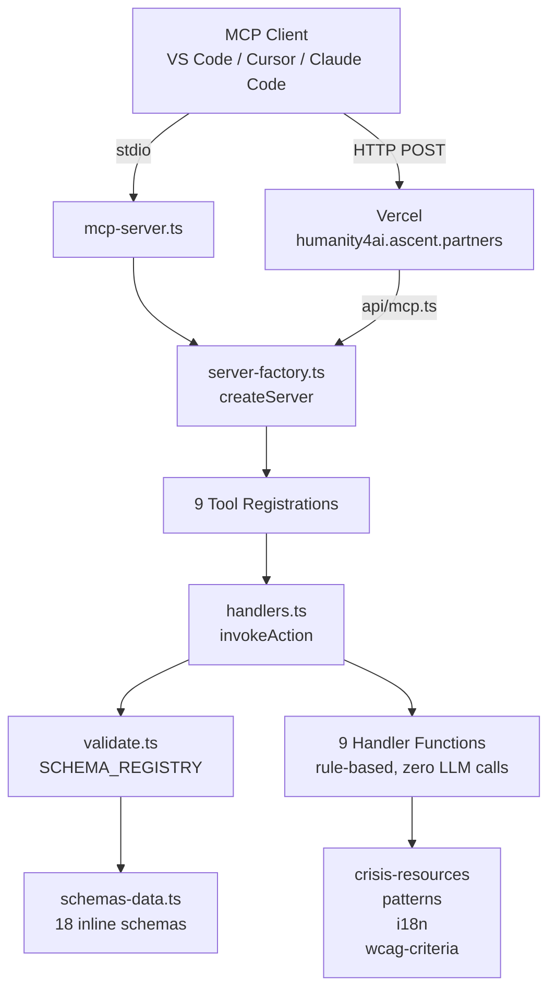

# Humanity4AI ⭐

**9 humanity skills for AI agents** — crisis detection, accessibility auditing, empathy, cultural sensitivity, and more. Ready-to-use via MCP, npm, or direct prompting.

[](https://github.com/humanity4ai/project_human/actions/workflows/ci.yml)
[](https://www.npmjs.com/package/@humanity4ai/mcp-servers)
[](LICENSE)
[](https://github.com/humanity4ai/project_human/releases)
[](https://github.com/humanity4ai/project_human?tab=readme-ov-file#quick-start)
[](https://github.com/humanity4ai/project_human/actions/workflows/codeql.yml)
[](https://registry.modelcontextprotocol.io?search=io.github.humanity4ai%2Fproject-human)

---

## Skills at a Glance

| Skill | Category | What it does |
|-------|----------|-------------|
| 🛡️ **Supportive Reply** | Emotional Safety | Detects crisis signals, generates supportive responses with escalation guidance |
| 📝 **Safe Content Rewriter** | Emotional Safety | Audits and rewrites text to remove harmful, stigmatising, or triggering patterns |
| ♿ **Accessibility Audit** | Accessibility | Scores pages against all 86 WCAG 2.2 success criteria (A/AA/AAA) |
| 🧠 **Cognitive Accessibility** | Cognitive Support | Audits content for reading level, structure, and cognitive load |
| 🌍 **Cultural Context Check** | Cultural Context | Flags cultural sensitivity issues for a given audience and region |
| 🔥 **De-escalation Plan** | Conflict Navigation | Generates structured de-escalation plans calibrated to conflict intensity |
| 💬 **Empathetic Reframe** | Communication | Reframes messages with genuine empathy, catching hollow empathy patterns |
| 🧩 **Neurodiversity Design** | Neurodiversity | Audits UIs for ADHD, autism, dyslexia, and sensory sensitivity |
| 👶 **Age-Inclusive Design** | Age Inclusion | Audits user flows for age barriers across children, adults, and older users |

> ⭐ **If you find this useful, a star helps others discover it**

[](https://www.star-history.com/#humanity4ai/project_human&Date)

---

## Quick Start

**Zero setup — just a URL:**

```json
{
  "mcpServers": {
    "humanity4ai": {
      "url": "https://humanity4ai.ascent.partners/api/mcp"
    }
  }
}
```

**Or one command with npx:**

```bash
npx @humanity4ai/mcp-servers
```

Then configure your MCP client:

```json
{
  "mcpServers": {
    "humanity4ai": {
      "command": "npx",
      "args": ["-y", "@humanity4ai/mcp-servers"]
    }
  }
}
```

**Docker**: `docker compose up`  
**For contributors**: `git clone … && pnpm install && pnpm start`  

All 9 skills are discoverable via `tools/list` and invocable via `tools/call`.

**Prerequisites (for local only):** Node.js >= 22, pnpm >= 10 | Windows, macOS, Linux, Android, iOS

---

## Architecture



## Four Ways to Use

| Method | Best for | How |
|--------|----------|-----|
| **Remote URL** | Zero-setup, any MCP client | Point to `https://humanity4ai.ascent.partners/api/mcp` |
| **MCP Server** | VS Code, Cursor, Claude Code, Copilot, Manus AI, OpenCode | `npx @humanity4ai/mcp-servers` or clone & start |
| **LLM Prompting** | ChatGPT, Claude, Gemini (web chat) | Share `llms.txt` or paste `llms-full.txt` into the chat |
| **Local Files** | Offline CLI tools | Clone the repo, point your tool at the `skills/` directory |

See [Agent Adapter Guide](docs/agent-adapters.md) for platform-specific setup instructions.

---

## Why Humanity4AI?

AI agents are everywhere — but they're not always humane. Humanity4AI gives agents **reusable, tested skills** for the moments that matter:

- An agent detects a user in crisis → **Supportive Reply** generates an appropriate response and escalates to qualified help
- A UI is inaccessible to screen readers → **Accessibility Audit** scores it against WCAG 2.2 and provides remediation
- Content uses stigmatising language → **Safe Content Rewriter** flags and rewrites harmful patterns
- A conflict is escalating → **De-escalation Plan** generates structured, non-coercive guidance

Every skill includes:
- **Explicit safety boundaries** — what the skill can and cannot do
- **Uncertainty disclosure** — confidence level stated upfront (low/medium/high)
- **Evaluation gates** — automated baseline checks for quality

These skills are **rule-based and non-clinical** — they do not provide diagnosis, treatment, or professional medical/legal advice.

---

## Supported Platforms

OpenCode · Claude Code · Microsoft Copilot · Manus AI · OpenClaw · ChatGPT · Claude · Gemini

---

## Contribute

```bash
git clone https://github.com/<your-username>/project_human.git
cd project_human
git checkout -b my-contribution
# Copy the skill template if adding a new skill:
cp -r templates/skill skills/my-skill-name
pnpm check && pnpm evals && pnpm test  # Run all checks before PR
```

Open a PR targeting `main`. Browse [good first issues](https://github.com/humanity4ai/project_human/issues?q=is%3Aopen+label%3A%22good+first+issue%22) or read the [Contributing Guide](CONTRIBUTING.md).

| Error | Fix |
|-------|-----|
| `ERR_PNPM_OUTDATED_LOCKFILE` | Run `pnpm install`, then commit `pnpm-lock.yaml` |
| `pnpm: command not found` | `npm install -g pnpm` |
| `pnpm evals` fails | `EVAL_REPORT=1 pnpm evals` — see `evals/reports/latest.md` |

---

## Resources

- [Contributing Guide](CONTRIBUTING.md)
- [Agent Adapter Guide](docs/agent-adapters.md)
- [Governance](docs/GOVERNANCE.md)
- [Roadmap](docs/ROADMAP.md)
- [Release Process](docs/release-process.md)
- [Public Site](https://humanity4ai.github.io/project_human/)

---

**[Share on X](https://twitter.com/intent/tweet?text=Humanity4AI%20%E2%80%94%209%20humanity%20skills%20for%20AI%20agents%20%F0%9F%A4%9D%0A%0ACrisis%20detection%2C%20WCAG%20audits%2C%20empathy%2C%20cultural%20sensitivity%2C%20and%20more.%0A%0Ahttps%3A%2F%2Fgithub.com%2Fhumanity4ai%2Fproject_human)** · MIT License · Copyright © 2026 Ascent Partners Foundation
